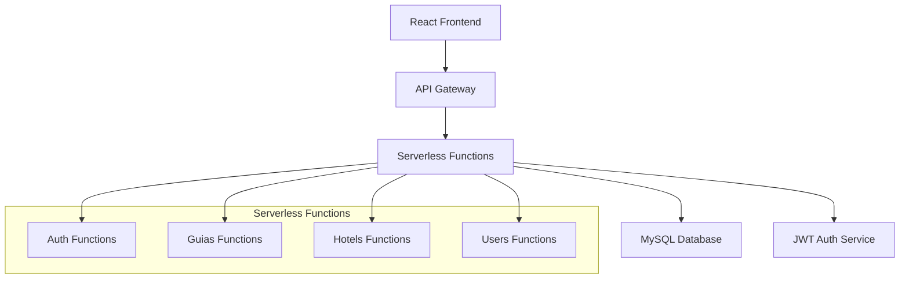

# Documento de Diseño - Sistema de Gestión de Guías de Lavandería

## Resumen

El Sistema de Gestión de Guías de Lavandería será desarrollado como una aplicación web serverless utilizando Node.js para el backend y React para el frontend. La arquitectura aprovechará servicios en la nube para escalabilidad automática y reducción de costos operativos.

## Arquitectura

### Stack Tecnológico

- **Frontend**: React 18+ con TypeScript
- **Backend**: Node.js con Express.js (serverless functions)
- **Base de Datos**: MySQL (PlanetScale, AWS RDS, o Railway)
- **Autenticación**: JWT (JSON Web Tokens)
- **Hosting Frontend**: Vercel o Netlify
- **Backend Serverless**: Vercel Functions o AWS Lambda
- **Estado Global**: React Context API + useReducer

### Arquitectura Serverless



## Componentes y Interfaces

### Frontend - Estructura de Componentes React

```
src/
├── components/
│   ├── common/
│   │   ├── Layout.tsx
│   │   ├── Navigation.tsx
│   │   └── ProtectedRoute.tsx
│   ├── auth/
│   │   └── LoginForm.tsx
│   ├── guias/
│   │   ├── GuiaForm.tsx
│   │   ├── GuiasList.tsx
│   │   ├── GuiaDetails.tsx
│   │   └── GuiaTracking.tsx
│   ├── hotels/
│   │   └── HotelManagement.tsx
│   └── users/
│       └── UserManagement.tsx
├── contexts/
│   ├── AuthContext.tsx
│   └── GuiasContext.tsx
├── hooks/
│   ├── useAuth.ts
│   └── useGuias.ts
├── services/
│   └── api.ts
└── types/
    └── index.ts
```

### Backend - API Endpoints (Serverless Functions)

#### Autenticación
- `POST /api/auth/login` - Autenticación de usuario
- `POST /api/auth/refresh` - Renovar token
- `POST /api/auth/logout` - Cerrar sesión

#### Gestión de Guías
- `GET /api/guias` - Listar guías (filtros por rol)
- `POST /api/guias` - Crear nueva guía
- `GET /api/guias/:id` - Obtener guía específica
- `PUT /api/guias/:id` - Actualizar guía
- `PUT /api/guias/:id/estado` - Cambiar estado de guía
- `PUT /api/guias/:id/cantidades` - Actualizar cantidades procesadas

#### Gestión de Hoteles
- `GET /api/hoteles` - Listar hoteles
- `POST /api/hoteles` - Crear hotel
- `PUT /api/hoteles/:id` - Actualizar hotel
- `DELETE /api/hoteles/:id` - Eliminar hotel

#### Gestión de Usuarios
- `GET /api/usuarios` - Listar usuarios
- `POST /api/usuarios` - Crear usuario
- `PUT /api/usuarios/:id` - Actualizar usuario
- `DELETE /api/usuarios/:id` - Eliminar usuario

## Modelos de Datos

### Esquema de Base de Datos MySQL

#### Tabla: usuarios
```sql
CREATE TABLE usuarios (
  id INT PRIMARY KEY AUTO_INCREMENT,
  dni VARCHAR(20) UNIQUE NOT NULL,
  nombres VARCHAR(255) NOT NULL,
  tipo_usuario ENUM('hotel', 'lavanderia', 'administrador') NOT NULL,
  rol ENUM('recepcionista', 'chofer', 'operario', 'encargado', 'administrador') NOT NULL,
  hotel_id INT NULL,
  email VARCHAR(255) UNIQUE NOT NULL,
  password VARCHAR(255) NOT NULL,
  activo BOOLEAN DEFAULT TRUE,
  fecha_creacion TIMESTAMP DEFAULT CURRENT_TIMESTAMP,
  FOREIGN KEY (hotel_id) REFERENCES hoteles(id)
);
```

#### Tabla: hoteles
```sql
CREATE TABLE hoteles (
  id INT PRIMARY KEY AUTO_INCREMENT,
  ruc VARCHAR(20) UNIQUE NOT NULL,
  nombre VARCHAR(255) NOT NULL,
  razon_social VARCHAR(255) NOT NULL,
  telefono VARCHAR(20),
  email VARCHAR(255),
  direccion TEXT,
  ultimo_numero_guia INT DEFAULT 0,
  activo BOOLEAN DEFAULT TRUE,
  fecha_creacion TIMESTAMP DEFAULT CURRENT_TIMESTAMP
);
```

#### Tabla: guias_lavanderia
```sql
CREATE TABLE guias_lavanderia (
  id INT PRIMARY KEY AUTO_INCREMENT,
  numero_guia INT NOT NULL,
  hotel_id INT NOT NULL,
  fecha_registro TIMESTAMP DEFAULT CURRENT_TIMESTAMP,
  estado ENUM('Registrado', 'Pendiente', 'Procesandose', 'Lista para Entregar', 'En Ruta', 'Entregado') DEFAULT 'Registrado',
  tipo_ropa VARCHAR(50) DEFAULT 'Ropa Cama',
  recepcionista_id INT NOT NULL,
  chofer_id INT NOT NULL,
  observaciones TEXT,
  fecha_actualizacion TIMESTAMP DEFAULT CURRENT_TIMESTAMP ON UPDATE CURRENT_TIMESTAMP,
  FOREIGN KEY (hotel_id) REFERENCES hoteles(id),
  FOREIGN KEY (recepcionista_id) REFERENCES usuarios(id),
  FOREIGN KEY (chofer_id) REFERENCES usuarios(id),
  UNIQUE KEY unique_guia_hotel (numero_guia, hotel_id)
);
```

#### Tabla: prendas
```sql
CREATE TABLE prendas (
  id INT PRIMARY KEY AUTO_INCREMENT,
  nombre VARCHAR(255) NOT NULL,
  categoria VARCHAR(100),
  activo BOOLEAN DEFAULT TRUE,
  fecha_creacion TIMESTAMP DEFAULT CURRENT_TIMESTAMP
);
```

#### Tabla: guia_prendas
```sql
CREATE TABLE guia_prendas (
  id INT PRIMARY KEY AUTO_INCREMENT,
  guia_id INT NOT NULL,
  prenda_id INT NOT NULL,
  cantidad_registrada INT NOT NULL,
  cantidad_procesada INT DEFAULT 0,
  cantidad_pendiente INT DEFAULT 0,
  es_devuelta BOOLEAN DEFAULT FALSE,
  FOREIGN KEY (guia_id) REFERENCES guias_lavanderia(id) ON DELETE CASCADE,
  FOREIGN KEY (prenda_id) REFERENCES prendas(id)
);
```

#### Tabla: historial_estados
```sql
CREATE TABLE historial_estados (
  id INT PRIMARY KEY AUTO_INCREMENT,
  guia_id INT NOT NULL,
  estado VARCHAR(50) NOT NULL,
  fecha TIMESTAMP DEFAULT CURRENT_TIMESTAMP,
  usuario_id INT NOT NULL,
  observaciones TEXT,
  FOREIGN KEY (guia_id) REFERENCES guias_lavanderia(id) ON DELETE CASCADE,
  FOREIGN KEY (usuario_id) REFERENCES usuarios(id)
);
```

### Interfaces TypeScript

#### Usuario
```typescript
interface Usuario {
  id: number;
  dni: string;
  nombres: string;
  tipoUsuario: 'hotel' | 'lavanderia' | 'administrador';
  rol: 'recepcionista' | 'chofer' | 'operario' | 'encargado' | 'administrador';
  hotelId?: number;
  email: string;
  password: string;
  activo: boolean;
  fechaCreacion: Date;
}
```

#### Hotel
```typescript
interface Hotel {
  id: number;
  ruc: string;
  nombre: string;
  razonSocial: string;
  telefono: string;
  email: string;
  direccion: string;
  ultimoNumeroGuia: number;
  activo: boolean;
  fechaCreacion: Date;
}
```

#### Guía de Lavandería
```typescript
interface GuiaLavanderia {
  id: number;
  numeroGuia: number;
  hotelId: number;
  fechaRegistro: Date;
  estado: 'Registrado' | 'Pendiente' | 'Procesandose' | 'Lista para Entregar' | 'En Ruta' | 'Entregado';
  tipoRopa: string;
  recepcionistaId: number;
  choferId: number;
  observaciones?: string;
  fechaActualizacion: Date;
  prendas?: PrendaGuia[];
  historialEstados?: HistorialEstado[];
}
```

#### Prenda en Guía
```typescript
interface PrendaGuia {
  id: number;
  guiaId: number;
  prendaId: number;
  nombrePrenda: string;
  cantidadRegistrada: number;
  cantidadProcesada: number;
  cantidadPendiente: number;
  esDevuelta: boolean;
}
```

#### Prenda (Catálogo)
```typescript
interface Prenda {
  id: number;
  nombre: string;
  categoria: string;
  activo: boolean;
  fechaCreacion: Date;
}
```

#### Historial de Estados
```typescript
interface HistorialEstado {
  id: number;
  guiaId: number;
  estado: string;
  fecha: Date;
  usuarioId: number;
  observaciones?: string;
}
```

## Lógica de Negocio

### Numeración Secuencial por Hotel
- Cada hotel mantiene su propio contador de guías
- Se implementará un campo `ultimo_numero_guia` en la tabla hoteles
- Al crear una guía, se incrementa atómicamente el contador usando transacciones MySQL
- Constraint UNIQUE en (numero_guia, hotel_id) para garantizar unicidad

### Estados de Guía
1. **Registrado**: Estado inicial al crear la guía
2. **Pendiente**: Cuando hay prendas parcialmente procesadas
3. **Procesándose**: Cuando está en lavandería (cambio manual por operario)
4. **Lista para Entregar**: Todas las prendas procesadas
5. **En Ruta**: Chofer recogió la ropa (cambio manual)
6. **Entregado**: Entrega completada (cambio manual)

### Control de Acceso por Roles

#### Recepcionista (Hotel)
- Crear guías para su hotel
- Ver guías de su hotel (solo lectura)

#### Operario (Lavandería)
- Ver todas las guías en estado "Registrado" y "Pendiente"
- Actualizar cantidades procesadas
- Cambiar estados operativos

#### Encargado (Hotel)
- Ver tracking de guías de su hotel únicamente
- Solo lectura

#### Administrador
- Acceso completo a todos los módulos
- Gestión de usuarios, hoteles y prendas

## Manejo de Errores

### Frontend
- Interceptores de Axios para manejo centralizado de errores HTTP
- Componente ErrorBoundary para errores de React
- Notificaciones toast para feedback al usuario
- Validación de formularios con react-hook-form + yup

### Backend
- Middleware de manejo de errores centralizado
- Validación de entrada con joi o express-validator
- Logging de errores para debugging
- Respuestas HTTP consistentes

```typescript
interface ApiResponse<T> {
  success: boolean;
  data?: T;
  error?: {
    message: string;
    code: string;
  };
}
```

## Estrategia de Testing

### Frontend Testing
- **Unit Tests**: Jest + React Testing Library
  - Componentes individuales
  - Hooks personalizados
  - Utilidades y helpers

- **Integration Tests**: 
  - Flujos completos de usuario
  - Interacciones entre componentes

### Backend Testing
- **Unit Tests**: Jest
  - Funciones de negocio
  - Validaciones
  - Utilidades

- **API Tests**: Supertest
  - Endpoints de API
  - Autenticación y autorización
  - Validación de datos

### E2E Testing (Opcional)
- Cypress o Playwright para flujos críticos
- Registro de guía completo
- Login y navegación por roles

## Consideraciones de Seguridad

### Autenticación y Autorización
- JWT con expiración corta (15 minutos)
- Refresh tokens para renovación automática
- Middleware de autorización por rol en cada endpoint
- Validación de pertenencia a hotel para usuarios restringidos

### Validación de Datos
- Sanitización de inputs en frontend y backend
- Validación de tipos TypeScript
- Esquemas de validación con joi/yup
- Rate limiting en API endpoints

### Base de Datos
- Conexiones encriptadas (TLS/SSL)
- Índices para optimización de consultas
- Backup automático (PlanetScale/AWS RDS)
- Constraints y foreign keys para integridad referencial
- Transacciones ACID para operaciones críticas

## Deployment y DevOps

### Desarrollo Local
- Docker Compose para MySQL local
- Variables de entorno para configuración
- Hot reload para desarrollo
- Migraciones de base de datos con Knex.js o Prisma

### Producción
- **Frontend**: Deploy automático en Vercel/Netlify
- **Backend**: Serverless functions en Vercel/AWS Lambda
- **Base de Datos**: PlanetScale, AWS RDS, o Railway MySQL
- **Monitoreo**: Logs centralizados y métricas de performance

### CI/CD Pipeline
- GitHub Actions para testing automático
- Deploy automático en merge a main
- Rollback automático en caso de errores