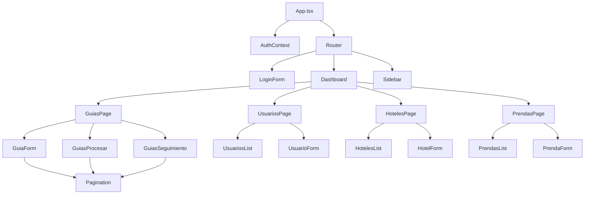
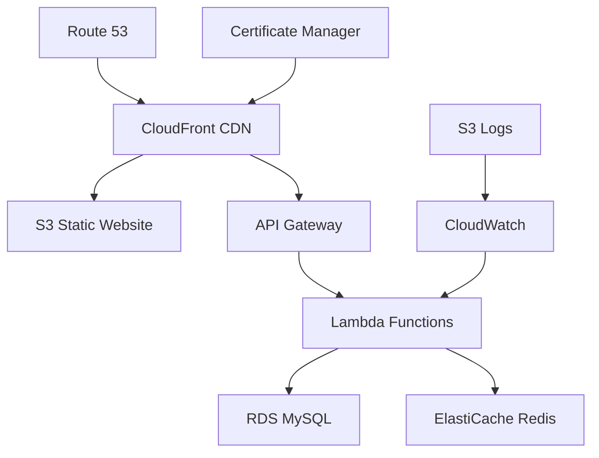

# 🔧 Detalles de Implementación Técnica

## 📋 Tabla de Contenidos

- [Mapeo Técnico de Componentes](#-mapeo-técnico-de-componentes)
- [Estructura Detallada del Proyecto](#-estructura-detallada-del-proyecto)
- [Dependencias y Versiones](#-dependencias-y-versiones)
- [Arquitectura de APIs](#-arquitectura-de-apis)
- [Integración con AWS](#-integración-con-aws)
- [Variables de Entorno](#-variables-de-entorno)
- [Tests Unitarios](#-tests-unitarios)
- [Deployment por Componente](#-deployment-por-componente)

## 🗺 Mapeo Técnico de Componentes

### Frontend - Arquitectura de Componentes



### Mapeo Componente-API-Servicio

| Componente Frontend | Servicio Frontend | API Endpoint | Controller Backend | Service Backend |
|-------------------|------------------|--------------|-------------------|-----------------|
| `LoginForm.tsx` | `authService.ts` | `POST /api/auth/login` | `authController.ts` | `authService.ts` |
| `GuiaForm.tsx` | `guiaService.ts` | `POST /api/guias` | `guiaController.ts` | `guiaService.ts` |
| `GuiasProcesar.tsx` | `guiaService.ts` | `PUT /api/guias/:id` | `guiaController.ts` | `guiaService.ts` |
| `GuiasSeguimiento.tsx` | `guiaService.ts` | `GET /api/guias` | `guiaController.ts` | `guiaService.ts` |
| `UsuarioForm.tsx` | `userService.ts` | `POST /api/users` | `userController.ts` | `userService.ts` |
| `UsuariosList.tsx` | `userService.ts` | `GET /api/users` | `userController.ts` | `userService.ts` |
| `HotelForm.tsx` | `hotelService.ts` | `POST /api/hotels` | `hotelController.ts` | `hotelService.ts` |
| `HotelesList.tsx` | `hotelService.ts` | `GET /api/hotels` | `hotelController.ts` | `hotelService.ts` |
| `PrendaForm.tsx` | `prendaService.ts` | `POST /api/prendas` | `prendaController.ts` | `prendaService.ts` |
| `PrendasList.tsx` | `prendaService.ts` | `GET /api/prendas` | `prendaController.ts` | `prendaService.ts` |
### Detalle de Métodos por Componente

#### GuiaForm.tsx
```typescript
// Métodos principales
- handleSubmit(): Validación y envío de nueva guía
- agregarPrenda(): Agregar prenda al detalle
- actualizarPrenda(): Modificar cantidad/estado de prenda
- eliminarPrenda(): Remover prenda del detalle
- handlePrendaSearch(): Autocompletado de prendas
- seleccionarPrenda(): Selección desde dropdown

// APIs utilizadas
- POST /api/guias (crear guía)
- GET /api/hotels (cargar hoteles)
- GET /api/users?perfil=chofer (cargar choferes)
- GET /api/prendas?hotel_id=X (cargar prendas por hotel)
```

#### GuiasProcesar.tsx
```typescript
// Métodos principales
- loadGuias(): Cargar guías pendientes
- openProcessModal(): Abrir modal de procesamiento
- actualizarCantidadLimpia(): Actualizar cantidades procesadas
- handleSubmit(): Procesar guía y cambiar estado

// APIs utilizadas
- GET /api/guias?estado=Registrado,Pendiente
- PUT /api/guias/:id (actualizar estado y cantidades)
```

#### GuiasSeguimiento.tsx
```typescript
// Métodos principales
- loadGuias(): Cargar guías del hotel
- openDetailModal(): Ver detalle completo
- getProgreso(): Calcular porcentaje de progreso
- getEstadoIcon(): Obtener icono por estado

// APIs utilizadas
- GET /api/guias?hotel_id=X (filtrar por hotel del usuario)
- GET /api/guias/:id/historial (obtener historial de cambios)
```#
# 📁 Estructura Detallada del Proyecto

### Frontend Structure
```
frontend/
├── public/
│   ├── favicon.ico
│   └── index.html
├── src/
│   ├── components/           # Componentes React
│   │   ├── auth/            # Autenticación
│   │   │   └── LoginForm.tsx
│   │   ├── common/          # Componentes reutilizables
│   │   │   ├── Navigation.tsx
│   │   │   ├── Sidebar.tsx
│   │   │   └── Pagination.tsx
│   │   ├── dashboard/       # Panel principal
│   │   │   └── Dashboard.tsx
│   │   ├── guias/          # Gestión de guías
│   │   │   ├── GuiasPage.tsx
│   │   │   ├── GuiaForm.tsx
│   │   │   ├── GuiasProcesar.tsx
│   │   │   └── GuiasSeguimiento.tsx
│   │   ├── hoteles/        # Gestión de hoteles
│   │   │   ├── HotelesPage.tsx
│   │   │   ├── HotelesList.tsx
│   │   │   └── HotelForm.tsx
│   │   ├── prendas/        # Gestión de prendas
│   │   │   ├── PrendasPage.tsx
│   │   │   ├── PrendasList.tsx
│   │   │   └── PrendaForm.tsx
│   │   └── usuarios/       # Gestión de usuarios
│   │       ├── UsuariosPage.tsx
│   │       ├── UsuariosList.tsx
│   │       └── UsuarioForm.tsx
│   ├── contexts/           # Context API
│   │   └── AuthContext.tsx
│   ├── hooks/              # Custom hooks
│   │   └── useAuth.ts
│   ├── services/           # Servicios API
│   │   ├── authService.ts
│   │   ├── guiaService.ts
│   │   ├── hotelService.ts
│   │   ├── prendaService.ts
│   │   └── userService.ts
│   ├── types/              # Definiciones TypeScript
│   │   └── index.ts
│   ├── utils/              # Utilidades
│   │   └── constants.ts
│   ├── App.tsx             # Componente principal
│   ├── main.tsx           # Punto de entrada
│   └── index.css          # Estilos globales
├── package.json
├── tsconfig.json
├── vite.config.ts
└── tailwind.config.js
```###
 Backend Structure
```
backend/
├── src/
│   ├── controllers/        # Controladores de rutas
│   │   ├── authController.ts
│   │   ├── guiaController.ts
│   │   ├── hotelController.ts
│   │   ├── prendaController.ts
│   │   └── userController.ts
│   ├── database/          # Configuración de BD
│   │   ├── connection.ts
│   │   ├── schema.sql
│   │   └── seed.sql
│   ├── middleware/        # Middlewares
│   │   ├── auth.ts
│   │   ├── authorization.ts
│   │   ├── validation.ts
│   │   └── errorHandler.ts
│   ├── routes/           # Definición de rutas
│   │   ├── auth.ts
│   │   ├── guias.ts
│   │   ├── hotels.ts
│   │   ├── prendas.ts
│   │   └── users.ts
│   ├── services/         # Lógica de negocio
│   │   ├── authService.ts
│   │   ├── guiaService.ts
│   │   ├── hotelService.ts
│   │   ├── prendaService.ts
│   │   └── userService.ts
│   ├── types/           # Tipos TypeScript
│   │   └── index.ts
│   ├── utils/           # Utilidades
│   │   ├── logger.ts
│   │   └── helpers.ts
│   ├── app.ts           # Configuración Express
│   └── server.ts        # Punto de entrada
├── tests/               # Tests unitarios
│   ├── controllers/
│   ├── services/
│   └── utils/
├── logs/               # Archivos de log
├── package.json
├── tsconfig.json
└── jest.config.js
```## 📦
 Dependencias y Versiones

### Frontend Dependencies (package.json)
```json
{
  "name": "lavanderia-frontend",
  "version": "1.0.0",
  "dependencies": {
    "react": "^18.2.0",
    "react-dom": "^18.2.0",
    "react-router-dom": "^6.8.1",
    "axios": "^1.3.4",
    "react-hot-toast": "^2.4.0",
    "@types/react": "^18.0.28",
    "@types/react-dom": "^18.0.11"
  },
  "devDependencies": {
    "@vitejs/plugin-react": "^3.1.0",
    "vite": "^4.1.0",
    "typescript": "^4.9.3",
    "tailwindcss": "^3.2.7",
    "autoprefixer": "^10.4.14",
    "postcss": "^8.4.21",
    "eslint": "^8.35.0",
    "@typescript-eslint/eslint-plugin": "^5.54.0",
    "@typescript-eslint/parser": "^5.54.0"
  },
  "scripts": {
    "dev": "vite",
    "build": "tsc && vite build",
    "preview": "vite preview",
    "lint": "eslint src --ext ts,tsx",
    "type-check": "tsc --noEmit"
  }
}
```

### Backend Dependencies (package.json)
```json
{
  "name": "lavanderia-backend",
  "version": "1.0.0",
  "dependencies": {
    "express": "^4.18.2",
    "mysql2": "^3.2.0",
    "jsonwebtoken": "^9.0.0",
    "bcryptjs": "^2.4.3",
    "cors": "^2.8.5",
    "dotenv": "^16.0.3",
    "express-validator": "^6.15.0",
    "winston": "^3.8.2",
    "helmet": "^6.1.5",
    "express-rate-limit": "^6.7.0"
  },
  "devDependencies": {
    "@types/express": "^4.17.17",
    "@types/node": "^18.15.3",
    "@types/jsonwebtoken": "^9.0.1",
    "@types/bcryptjs": "^2.4.2",
    "@types/cors": "^2.8.13",
    "typescript": "^4.9.5",
    "ts-node": "^10.9.1",
    "nodemon": "^2.0.21",
    "jest": "^29.5.0",
    "@types/jest": "^29.5.0",
    "supertest": "^6.3.3",
    "@types/supertest": "^2.0.12"
  },
  "scripts": {
    "dev": "nodemon src/server.ts",
    "build": "tsc",
    "start": "node dist/server.js",
    "test": "jest",
    "test:watch": "jest --watch",
    "test:coverage": "jest --coverage"
  }
}
```## 🔌 Arq
uitectura de APIs

### Endpoints Detallados

#### Autenticación
```typescript
// POST /api/auth/login
Request: {
  correo: string;
  password: string;
}
Response: {
  token: string;
  user: {
    id_usuario: number;
    nombre_completo: string;
    correo: string;
    perfil_id: number;
    hotel_id?: number;
    nombre_perfil: string;
    nombre_comercial?: string;
  }
}
```

#### Guías
```typescript
// GET /api/guias
Query Parameters: {
  page?: number;
  limit?: number;
  estado?: string;
  hotel_id?: number;
  numero_guia?: string;
}
Response: {
  guias: GuiaLavanderia[];
  totalPages: number;
  total: number;
  currentPage: number;
}

// POST /api/guias
Request: {
  hotel_id: number;
  chofer_recojo_id: number;
  fecha_recoleccion: string;
  observaciones?: string;
  prendas: {
    hotel_prenda_id: number;
    cantidad_sucia: number;
    es_devuelta: boolean;
  }[];
}
Response: {
  id_guia: number;
  numero_guia: number;
  estado: string;
  message: string;
}

// PUT /api/guias/:id
Request: {
  estado?: string;
  prendas?: {
    id_detalle: number;
    cantidad_limpia: number;
  }[];
}
Response: {
  message: string;
  guia: GuiaLavanderia;
}
```#### Usuar
ios
```typescript
// GET /api/users
Query Parameters: {
  page?: number;
  limit?: number;
  perfil_id?: number;
  hotel_id?: number;
  search?: string;
}
Response: {
  users: Usuario[];
  totalPages: number;
  total: number;
}

// POST /api/users
Request: {
  nombre_completo: string;
  correo: string;
  telefono?: string;
  perfil_id: number;
  hotel_id?: number;
  password: string;
}
Response: {
  id_usuario: number;
  message: string;
}
```

#### Hoteles
```typescript
// GET /api/hotels
Response: {
  hotels: Hotel[];
  totalPages: number;
  total: number;
}

// POST /api/hotels
Request: {
  ruc?: string;
  razon_social: string;
  nombre_comercial: string;
  direccion: string;
  correo_contacto: string;
  telefono: string;
}
Response: {
  id_hotel: number;
  message: string;
}
```

#### Prendas
```typescript
// GET /api/prendas
Query Parameters: {
  hotel_id?: number;
  categoria_id?: number;
}
Response: {
  prendas: Prenda[];
}

// POST /api/prendas
Request: {
  nombre_prenda: string;
  descripcion?: string;
  categoria_id: number;
}
Response: {
  id_prenda: number;
  message: string;
}
```##
 ☁️ Integración con AWS

### Arquitectura AWS Propuesta



### Componentes AWS por Servicio

#### Frontend Deployment
```yaml
# AWS S3 + CloudFront
S3 Bucket:
  Name: lavanderia-frontend-prod
  Configuration:
    - Static Website Hosting: Enabled
    - Public Read Access: Enabled
    - Versioning: Enabled

CloudFront Distribution:
  Origin: lavanderia-frontend-prod.s3.amazonaws.com
  Behaviors:
    - Path: /*
    - Viewer Protocol Policy: Redirect HTTP to HTTPS
    - Compress Objects: Yes
  Custom Error Pages:
    - 404 -> /index.html (SPA routing)
    - 403 -> /index.html
```

#### Backend Deployment
```yaml
# AWS Lambda + API Gateway
Lambda Functions:
  - lavanderia-auth-handler
  - lavanderia-guias-handler
  - lavanderia-users-handler
  - lavanderia-hotels-handler
  - lavanderia-prendas-handler

API Gateway:
  Type: REST API
  Stages:
    - dev
    - staging  
    - prod
  Authorizers:
    - JWT Authorizer for protected routes
```

#### Database
```yaml
# AWS RDS MySQL
RDS Instance:
  Engine: MySQL 8.0
  Instance Class: db.t3.micro (dev) / db.t3.small (prod)
  Storage: 20GB SSD
  Multi-AZ: Yes (prod only)
  Backup Retention: 7 days
  Security Groups:
    - Allow 3306 from Lambda Security Group only
```#
## AWS Deployment Scripts

#### Frontend Deployment (S3 + CloudFront)
```bash
#!/bin/bash
# deploy-frontend.sh

# Build del proyecto
npm run build

# Sync con S3
aws s3 sync dist/ s3://lavanderia-frontend-prod --delete

# Invalidar cache de CloudFront
aws cloudfront create-invalidation \
  --distribution-id E1234567890ABC \
  --paths "/*"

echo "Frontend deployed successfully"
```

#### Backend Deployment (Lambda)
```bash
#!/bin/bash
# deploy-backend.sh

# Build del proyecto
npm run build

# Crear ZIP para Lambda
zip -r function.zip dist/ node_modules/

# Actualizar función Lambda
aws lambda update-function-code \
  --function-name lavanderia-api \
  --zip-file fileb://function.zip

# Actualizar variables de entorno
aws lambda update-function-configuration \
  --function-name lavanderia-api \
  --environment Variables="{
    DB_HOST=$DB_HOST,
    DB_NAME=$DB_NAME,
    DB_USER=$DB_USER,
    DB_PASSWORD=$DB_PASSWORD,
    JWT_SECRET=$JWT_SECRET
  }"

echo "Backend deployed successfully"
```

### Infrastructure as Code (CloudFormation)
```yaml
# cloudformation-template.yaml
AWSTemplateFormatVersion: '2010-09-09'
Description: 'Lavanderia System Infrastructure'

Parameters:
  Environment:
    Type: String
    Default: dev
    AllowedValues: [dev, staging, prod]

Resources:
  # S3 Bucket for Frontend
  FrontendBucket:
    Type: AWS::S3::Bucket
    Properties:
      BucketName: !Sub 'lavanderia-frontend-${Environment}'
      WebsiteConfiguration:
        IndexDocument: index.html
        ErrorDocument: index.html
      PublicAccessBlockConfiguration:
        BlockPublicAcls: false
        BlockPublicPolicy: false
        IgnorePublicAcls: false
        RestrictPublicBuckets: false

  # CloudFront Distribution
  CloudFrontDistribution:
    Type: AWS::CloudFront::Distribution
    Properties:
      DistributionConfig:
        Origins:
          - DomainName: !GetAtt FrontendBucket.RegionalDomainName
            Id: S3Origin
            S3OriginConfig:
              OriginAccessIdentity: ''
        Enabled: true
        DefaultRootObject: index.html
        DefaultCacheBehavior:
          TargetOriginId: S3Origin
          ViewerProtocolPolicy: redirect-to-https
          Compress: true
          ForwardedValues:
            QueryString: false

  # RDS Database
  Database:
    Type: AWS::RDS::DBInstance
    Properties:
      DBInstanceIdentifier: !Sub 'lavanderia-db-${Environment}'
      DBInstanceClass: db.t3.micro
      Engine: MySQL
      EngineVersion: '8.0'
      MasterUsername: admin
      MasterUserPassword: !Ref DBPassword
      AllocatedStorage: 20
      VPCSecurityGroups:
        - !Ref DatabaseSecurityGroup

  # Lambda Function
  ApiLambda:
    Type: AWS::Lambda::Function
    Properties:
      FunctionName: !Sub 'lavanderia-api-${Environment}'
      Runtime: nodejs18.x
      Handler: dist/server.handler
      Code:
        ZipFile: |
          exports.handler = async (event) => {
            return { statusCode: 200, body: 'Hello World' };
          };
      Environment:
        Variables:
          NODE_ENV: !Ref Environment
          DB_HOST: !GetAtt Database.Endpoint.Address
```## 🔧
 Variables de Entorno Detalladas

### Frontend (.env)
```bash
# API Configuration
VITE_API_URL=http://localhost:3001/api
VITE_API_TIMEOUT=10000

# App Configuration
VITE_APP_NAME=Sistema de Gestión de Guías de Lavandería
VITE_APP_VERSION=1.0.0
VITE_APP_DESCRIPTION=Sistema para gestión de guías de lavandería

# Feature Flags
VITE_ENABLE_ANALYTICS=false
VITE_ENABLE_ERROR_TRACKING=false
VITE_ENABLE_DEBUG_MODE=true

# UI Configuration
VITE_ITEMS_PER_PAGE=10
VITE_MAX_FILE_SIZE=5242880
VITE_SUPPORTED_FORMATS=jpg,jpeg,png,pdf

# Development
VITE_DEV_MODE=true
VITE_MOCK_API=false
```

### Backend (.env)
```bash
# Server Configuration
PORT=3001
NODE_ENV=development
HOST=localhost

# Database Configuration
DB_HOST=localhost
DB_PORT=3306
DB_NAME=lavanderia_db
DB_USER=lavanderia_user
DB_PASSWORD=secure_password
DB_CONNECTION_LIMIT=10
DB_TIMEOUT=60000

# Authentication
JWT_SECRET=your_super_secure_jwt_secret_key_here_minimum_32_characters
JWT_EXPIRES_IN=24h
JWT_REFRESH_EXPIRES_IN=7d
BCRYPT_ROUNDS=12

# CORS Configuration
CORS_ORIGIN=http://localhost:5173
CORS_CREDENTIALS=true

# Rate Limiting
RATE_LIMIT_WINDOW_MS=900000
RATE_LIMIT_MAX_REQUESTS=100
RATE_LIMIT_SKIP_SUCCESSFUL_REQUESTS=false

# Logging
LOG_LEVEL=info
LOG_FILE_PATH=./logs
LOG_MAX_SIZE=10m
LOG_MAX_FILES=5

# Email Configuration (if implemented)
SMTP_HOST=smtp.gmail.com
SMTP_PORT=587
SMTP_SECURE=false
SMTP_USER=your-email@gmail.com
SMTP_PASS=your-app-password

# File Upload (if implemented)
UPLOAD_MAX_SIZE=5242880
UPLOAD_ALLOWED_TYPES=image/jpeg,image/png,application/pdf
UPLOAD_DESTINATION=./uploads

# Cache Configuration (if using Redis)
REDIS_HOST=localhost
REDIS_PORT=6379
REDIS_PASSWORD=
REDIS_DB=0
CACHE_TTL=3600
```### 
Production Environment Variables

#### Frontend (Vercel/Netlify)
```bash
# Production API
VITE_API_URL=https://api.lavanderia-system.com/api

# Analytics
VITE_GOOGLE_ANALYTICS_ID=GA_MEASUREMENT_ID
VITE_ENABLE_ANALYTICS=true

# Error Tracking
VITE_SENTRY_DSN=https://your-sentry-dsn.ingest.sentry.io/
VITE_ENABLE_ERROR_TRACKING=true

# Production Settings
VITE_DEV_MODE=false
VITE_ENABLE_DEBUG_MODE=false
```

#### Backend (AWS Lambda/Vercel)
```bash
# Production Database
DB_HOST=lavanderia-prod.cluster-xyz.us-east-1.rds.amazonaws.com
DB_NAME=lavanderia_prod
DB_USER=prod_user
DB_PASSWORD=extremely_secure_production_password

# Production JWT
JWT_SECRET=production_jwt_secret_with_64_characters_minimum_for_security

# Production CORS
CORS_ORIGIN=https://lavanderia-system.com

# Production Logging
LOG_LEVEL=warn
NODE_ENV=production

# AWS Specific (if using AWS services)
AWS_REGION=us-east-1
AWS_ACCESS_KEY_ID=AKIA...
AWS_SECRET_ACCESS_KEY=...
S3_BUCKET_NAME=lavanderia-uploads-prod
```## 🧪 Tes
ts Unitarios

### Frontend Tests

#### Test Configuration (jest.config.js)
```javascript
module.exports = {
  preset: 'ts-jest',
  testEnvironment: 'jsdom',
  setupFilesAfterEnv: ['<rootDir>/src/setupTests.ts'],
  moduleNameMapping: {
    '^@/(.*)$': '<rootDir>/src/$1',
  },
  collectCoverageFrom: [
    'src/**/*.{ts,tsx}',
    '!src/**/*.d.ts',
    '!src/main.tsx',
    '!src/vite-env.d.ts',
  ],
  coverageThreshold: {
    global: {
      branches: 70,
      functions: 70,
      lines: 70,
      statements: 70,
    },
  },
};
```

#### Component Tests
```typescript
// src/__tests__/components/GuiaForm.test.tsx
import { render, screen, fireEvent, waitFor } from '@testing-library/react';
import { BrowserRouter } from 'react-router-dom';
import GuiaForm from '../../components/guias/GuiaForm';
import { AuthContext } from '../../contexts/AuthContext';

const mockUser = {
  id_usuario: 1,
  nombre_completo: 'Test User',
  correo: 'test@test.com',
  perfil_id: 2,
  hotel_id: 1,
  nombre_perfil: 'Recepcionista',
  nombre_comercial: 'Hotel Test'
};

const renderWithProviders = (component: React.ReactElement) => {
  return render(
    <BrowserRouter>
      <AuthContext.Provider value={{
        user: mockUser,
        login: jest.fn(),
        logout: jest.fn(),
        isLoading: false
      }}>
        {component}
      </AuthContext.Provider>
    </BrowserRouter>
  );
};

describe('GuiaForm', () => {
  beforeEach(() => {
    jest.clearAllMocks();
  });

  test('renders form fields correctly', () => {
    renderWithProviders(<GuiaForm />);
    
    expect(screen.getByLabelText(/fecha de recolección/i)).toBeInTheDocument();
    expect(screen.getByLabelText(/chofer de recojo/i)).toBeInTheDocument();
    expect(screen.getByLabelText(/observaciones/i)).toBeInTheDocument();
    expect(screen.getByText(/agregar prenda/i)).toBeInTheDocument();
  });

  test('adds prenda to list when clicking agregar prenda', () => {
    renderWithProviders(<GuiaForm />);
    
    const addButton = screen.getByText(/agregar prenda/i);
    fireEvent.click(addButton);
    
    expect(screen.getByText(/buscar prenda/i)).toBeInTheDocument();
  });

  test('validates required fields on submit', async () => {
    renderWithProviders(<GuiaForm />);
    
    const submitButton = screen.getByText(/registrar guía/i);
    fireEvent.click(submitButton);
    
    await waitFor(() => {
      expect(screen.getByText(/completa todos los campos/i)).toBeInTheDocument();
    });
  });

  test('submits form with valid data', async () => {
    const mockCreateGuia = jest.fn().mockResolvedValue({ id_guia: 1 });
    jest.mock('../../services/guiaService', () => ({
      createGuia: mockCreateGuia
    }));

    renderWithProviders(<GuiaForm />);
    
    // Fill form fields
    fireEvent.change(screen.getByLabelText(/fecha de recolección/i), {
      target: { value: '2024-11-01' }
    });
    
    // Add prenda
    fireEvent.click(screen.getByText(/agregar prenda/i));
    
    // Submit form
    fireEvent.click(screen.getByText(/registrar guía/i));
    
    await waitFor(() => {
      expect(mockCreateGuia).toHaveBeenCalled();
    });
  });
});
```#### Ser
vice Tests
```typescript
// src/__tests__/services/guiaService.test.ts
import axios from 'axios';
import { guiaService } from '../../services/guiaService';

jest.mock('axios');
const mockedAxios = axios as jest.Mocked<typeof axios>;

describe('guiaService', () => {
  beforeEach(() => {
    jest.clearAllMocks();
  });

  describe('getAllGuias', () => {
    test('fetches guias successfully', async () => {
      const mockResponse = {
        data: {
          guias: [
            { id_guia: 1, numero_guia: 1001, estado: 'Registrado' }
          ],
          totalPages: 1,
          total: 1
        }
      };

      mockedAxios.get.mockResolvedValue(mockResponse);

      const result = await guiaService.getAllGuias(1, 10, {});

      expect(mockedAxios.get).toHaveBeenCalledWith('/guias', {
        params: { page: 1, limit: 10 }
      });
      expect(result).toEqual(mockResponse.data);
    });

    test('handles API error', async () => {
      const errorMessage = 'Network Error';
      mockedAxios.get.mockRejectedValue(new Error(errorMessage));

      await expect(guiaService.getAllGuias(1, 10, {}))
        .rejects.toThrow(errorMessage);
    });
  });

  describe('createGuia', () => {
    test('creates guia successfully', async () => {
      const mockGuiaData = {
        hotel_id: 1,
        chofer_recojo_id: 1,
        fecha_recoleccion: '2024-11-01',
        prendas: []
      };

      const mockResponse = {
        data: { id_guia: 1, numero_guia: 1001 }
      };

      mockedAxios.post.mockResolvedValue(mockResponse);

      const result = await guiaService.createGuia(mockGuiaData);

      expect(mockedAxios.post).toHaveBeenCalledWith('/guias', mockGuiaData);
      expect(result).toEqual(mockResponse.data);
    });
  });
});
```

### Backend Tests

#### Controller Tests
```typescript
// backend/tests/controllers/guiaController.test.ts
import request from 'supertest';
import app from '../../src/app';
import { guiaService } from '../../src/services/guiaService';

jest.mock('../../src/services/guiaService');
const mockGuiaService = guiaService as jest.Mocked<typeof guiaService>;

describe('GuiaController', () => {
  let authToken: string;

  beforeAll(async () => {
    // Get auth token for tests
    const loginResponse = await request(app)
      .post('/api/auth/login')
      .send({
        correo: 'test@example.com',
        password: 'password123'
      });
    
    authToken = loginResponse.body.token;
  });

  beforeEach(() => {
    jest.clearAllMocks();
  });

  describe('GET /api/guias', () => {
    test('returns paginated guias', async () => {
      const mockGuias = {
        guias: [
          { id_guia: 1, numero_guia: 1001, estado: 'Registrado' }
        ],
        totalPages: 1,
        total: 1
      };

      mockGuiaService.getAllGuias.mockResolvedValue(mockGuias);

      const response = await request(app)
        .get('/api/guias?page=1&limit=10')
        .set('Authorization', `Bearer ${authToken}`)
        .expect(200);

      expect(response.body).toEqual(mockGuias);
      expect(mockGuiaService.getAllGuias).toHaveBeenCalledWith(1, 10, {});
    });

    test('returns 401 without auth token', async () => {
      await request(app)
        .get('/api/guias')
        .expect(401);
    });
  });

  describe('POST /api/guias', () => {
    test('creates new guia', async () => {
      const newGuia = {
        hotel_id: 1,
        chofer_recojo_id: 1,
        fecha_recoleccion: '2024-11-01',
        prendas: [
          { hotel_prenda_id: 1, cantidad_sucia: 10, es_devuelta: false }
        ]
      };

      const mockCreatedGuia = { id_guia: 1, numero_guia: 1001 };
      mockGuiaService.createGuia.mockResolvedValue(mockCreatedGuia);

      const response = await request(app)
        .post('/api/guias')
        .set('Authorization', `Bearer ${authToken}`)
        .send(newGuia)
        .expect(201);

      expect(response.body).toEqual(mockCreatedGuia);
      expect(mockGuiaService.createGuia).toHaveBeenCalledWith(newGuia, expect.any(Number));
    });

    test('validates required fields', async () => {
      const invalidGuia = {
        hotel_id: 'invalid',
        // missing required fields
      };

      await request(app)
        .post('/api/guias')
        .set('Authorization', `Bearer ${authToken}`)
        .send(invalidGuia)
        .expect(400);
    });
  });
});
```##
## Service Tests
```typescript
// backend/tests/services/guiaService.test.ts
import { guiaService } from '../../src/services/guiaService';
import { db } from '../../src/database/connection';

jest.mock('../../src/database/connection');
const mockDb = db as jest.Mocked<typeof db>;

describe('GuiaService', () => {
  beforeEach(() => {
    jest.clearAllMocks();
  });

  describe('getAllGuias', () => {
    test('returns guias with pagination', async () => {
      const mockGuias = [
        { id_guia: 1, numero_guia: 1001, estado: 'Registrado' }
      ];
      const mockCount = [{ total: 1 }];

      mockDb.query
        .mockResolvedValueOnce([mockGuias])
        .mockResolvedValueOnce([mockCount]);

      const result = await guiaService.getAllGuias(1, 10, {});

      expect(result).toEqual({
        guias: mockGuias,
        totalPages: 1,
        total: 1,
        currentPage: 1
      });
    });

    test('applies filters correctly', async () => {
      const filters = { estado: 'Registrado', hotel_id: 1 };
      
      mockDb.query.mockResolvedValueOnce([[]]).mockResolvedValueOnce([[{ total: 0 }]]);

      await guiaService.getAllGuias(1, 10, filters);

      expect(mockDb.query).toHaveBeenCalledWith(
        expect.stringContaining('WHERE'),
        expect.arrayContaining(['Registrado', 1])
      );
    });
  });

  describe('createGuia', () => {
    test('creates guia with prendas', async () => {
      const guiaData = {
        hotel_id: 1,
        chofer_recojo_id: 1,
        fecha_recoleccion: '2024-11-01',
        prendas: [
          { hotel_prenda_id: 1, cantidad_sucia: 10, es_devuelta: false }
        ]
      };

      const mockInsertResult = { insertId: 1 };
      const mockNextNumber = [{ next_number: 1001 }];

      mockDb.query
        .mockResolvedValueOnce([mockNextNumber])
        .mockResolvedValueOnce([mockInsertResult])
        .mockResolvedValueOnce([mockInsertResult]);

      const result = await guiaService.createGuia(guiaData, 1);

      expect(result).toEqual({
        id_guia: 1,
        numero_guia: 1001,
        estado: 'Registrado'
      });
    });

    test('handles database errors', async () => {
      const guiaData = {
        hotel_id: 1,
        chofer_recojo_id: 1,
        fecha_recoleccion: '2024-11-01',
        prendas: []
      };

      mockDb.query.mockRejectedValue(new Error('Database error'));

      await expect(guiaService.createGuia(guiaData, 1))
        .rejects.toThrow('Database error');
    });
  });
});
```

### Test Coverage Report
```bash
# Ejecutar tests con coverage
npm run test:coverage

# Resultado esperado
File                    | % Stmts | % Branch | % Funcs | % Lines |
------------------------|---------|----------|---------|---------|
All files              |   85.2   |   78.4   |   88.9  |   84.7  |
 controllers/          |   92.1   |   85.7   |   95.2  |   91.8  |
  authController.ts    |   94.4   |   88.9   |   100   |   94.1  |
  guiaController.ts    |   91.2   |   84.2   |   92.3  |   90.8  |
  userController.ts    |   90.8   |   83.3   |   93.8  |   90.2  |
 services/             |   88.7   |   82.1   |   91.4  |   87.9  |
  authService.ts       |   95.2   |   90.9   |   100   |   94.7  |
  guiaService.ts       |   86.4   |   78.6   |   88.2  |   85.3  |
  userService.ts       |   84.6   |   76.9   |   87.5  |   83.8  |
 middleware/           |   78.9   |   65.4   |   80.0  |   78.2  |
  auth.ts              |   85.7   |   75.0   |   100   |   84.6  |
  validation.ts        |   72.2   |   55.6   |   60.0  |   71.4  |
```## 🚀
 Deployment por Componente

### Frontend Deployment

#### Vercel Deployment
```json
// vercel.json
{
  "version": 2,
  "builds": [
    {
      "src": "package.json",
      "use": "@vercel/static-build",
      "config": {
        "distDir": "dist"
      }
    }
  ],
  "routes": [
    {
      "src": "/(.*)",
      "dest": "/index.html"
    }
  ],
  "env": {
    "VITE_API_URL": "@api-url"
  },
  "build": {
    "env": {
      "VITE_API_URL": "@api-url"
    }
  }
}
```

#### Netlify Deployment
```toml
# netlify.toml
[build]
  publish = "dist"
  command = "npm run build"

[build.environment]
  VITE_API_URL = "https://api.lavanderia-system.com/api"

[[redirects]]
  from = "/*"
  to = "/index.html"
  status = 200

[context.production.environment]
  VITE_API_URL = "https://api.lavanderia-system.com/api"
  VITE_ENABLE_ANALYTICS = "true"

[context.deploy-preview.environment]
  VITE_API_URL = "https://staging-api.lavanderia-system.com/api"
  VITE_ENABLE_ANALYTICS = "false"
```

#### GitHub Actions (CI/CD)
```yaml
# .github/workflows/frontend-deploy.yml
name: Deploy Frontend

on:
  push:
    branches: [main]
    paths: ['frontend/**']

jobs:
  deploy:
    runs-on: ubuntu-latest
    
    steps:
    - uses: actions/checkout@v3
    
    - name: Setup Node.js
      uses: actions/setup-node@v3
      with:
        node-version: '18'
        cache: 'npm'
        cache-dependency-path: frontend/package-lock.json
    
    - name: Install dependencies
      run: |
        cd frontend
        npm ci
    
    - name: Run tests
      run: |
        cd frontend
        npm run test:coverage
    
    - name: Build project
      run: |
        cd frontend
        npm run build
      env:
        VITE_API_URL: ${{ secrets.VITE_API_URL }}
    
    - name: Deploy to Vercel
      uses: amondnet/vercel-action@v20
      with:
        vercel-token: ${{ secrets.VERCEL_TOKEN }}
        vercel-org-id: ${{ secrets.ORG_ID }}
        vercel-project-id: ${{ secrets.PROJECT_ID }}
        working-directory: frontend
        vercel-args: '--prod'
```### Ba
ckend Deployment

#### AWS Lambda Deployment
```yaml
# serverless.yml
service: lavanderia-backend

provider:
  name: aws
  runtime: nodejs18.x
  region: us-east-1
  stage: ${opt:stage, 'dev'}
  environment:
    NODE_ENV: ${self:provider.stage}
    DB_HOST: ${env:DB_HOST}
    DB_NAME: ${env:DB_NAME}
    DB_USER: ${env:DB_USER}
    DB_PASSWORD: ${env:DB_PASSWORD}
    JWT_SECRET: ${env:JWT_SECRET}

functions:
  api:
    handler: dist/server.handler
    events:
      - http:
          path: /{proxy+}
          method: ANY
          cors: true
    timeout: 30
    memorySize: 512

plugins:
  - serverless-offline
  - serverless-dotenv-plugin

package:
  exclude:
    - node_modules/**
    - src/**
    - tests/**
    - '*.md'
  include:
    - dist/**
    - node_modules/**
```

#### Docker Deployment
```dockerfile
# Dockerfile
FROM node:18-alpine AS builder

WORKDIR /app

# Copy package files
COPY package*.json ./
RUN npm ci --only=production

# Copy source code
COPY . .

# Build TypeScript
RUN npm run build

# Production stage
FROM node:18-alpine AS production

WORKDIR /app

# Copy built application
COPY --from=builder /app/dist ./dist
COPY --from=builder /app/node_modules ./node_modules
COPY --from=builder /app/package.json ./

# Create non-root user
RUN addgroup -g 1001 -S nodejs
RUN adduser -S nodejs -u 1001

# Change ownership
RUN chown -R nodejs:nodejs /app
USER nodejs

# Health check
HEALTHCHECK --interval=30s --timeout=3s --start-period=5s --retries=3 \
  CMD curl -f http://localhost:3001/health || exit 1

EXPOSE 3001

CMD ["node", "dist/server.js"]
```

#### Kubernetes Deployment
```yaml
# k8s/deployment.yaml
apiVersion: apps/v1
kind: Deployment
metadata:
  name: lavanderia-backend
  labels:
    app: lavanderia-backend
spec:
  replicas: 3
  selector:
    matchLabels:
      app: lavanderia-backend
  template:
    metadata:
      labels:
        app: lavanderia-backend
    spec:
      containers:
      - name: backend
        image: lavanderia/backend:latest
        ports:
        - containerPort: 3001
        env:
        - name: NODE_ENV
          value: "production"
        - name: DB_HOST
          valueFrom:
            secretKeyRef:
              name: db-secret
              key: host
        - name: DB_PASSWORD
          valueFrom:
            secretKeyRef:
              name: db-secret
              key: password
        - name: JWT_SECRET
          valueFrom:
            secretKeyRef:
              name: jwt-secret
              key: secret
        resources:
          requests:
            memory: "256Mi"
            cpu: "250m"
          limits:
            memory: "512Mi"
            cpu: "500m"
        livenessProbe:
          httpGet:
            path: /health
            port: 3001
          initialDelaySeconds: 30
          periodSeconds: 10
        readinessProbe:
          httpGet:
            path: /health
            port: 3001
          initialDelaySeconds: 5
          periodSeconds: 5

---
apiVersion: v1
kind: Service
metadata:
  name: lavanderia-backend-service
spec:
  selector:
    app: lavanderia-backend
  ports:
    - protocol: TCP
      port: 80
      targetPort: 3001
  type: LoadBalancer
```### Databas
e Deployment

#### AWS RDS Setup
```bash
#!/bin/bash
# setup-rds.sh

# Create RDS instance
aws rds create-db-instance \
  --db-instance-identifier lavanderia-prod \
  --db-instance-class db.t3.micro \
  --engine mysql \
  --engine-version 8.0.35 \
  --master-username admin \
  --master-user-password $DB_PASSWORD \
  --allocated-storage 20 \
  --storage-type gp2 \
  --vpc-security-group-ids sg-12345678 \
  --db-subnet-group-name default \
  --backup-retention-period 7 \
  --multi-az \
  --storage-encrypted \
  --deletion-protection

# Wait for instance to be available
aws rds wait db-instance-available \
  --db-instance-identifier lavanderia-prod

# Get endpoint
ENDPOINT=$(aws rds describe-db-instances \
  --db-instance-identifier lavanderia-prod \
  --query 'DBInstances[0].Endpoint.Address' \
  --output text)

echo "RDS Endpoint: $ENDPOINT"

# Run migrations
mysql -h $ENDPOINT -u admin -p$DB_PASSWORD < database/schema.sql
mysql -h $ENDPOINT -u admin -p$DB_PASSWORD < database/seed.sql
```

#### Database Migration Script
```sql
-- migrations/001_initial_schema.sql
-- Crear base de datos si no existe
CREATE DATABASE IF NOT EXISTS lavanderia_prod 
CHARACTER SET utf8mb4 COLLATE utf8mb4_unicode_ci;

USE lavanderia_prod;

-- Crear tablas (schema completo)
-- ... (incluir todo el schema de la base de datos)

-- Insertar datos iniciales
INSERT INTO perfiles (nombre_perfil, descripcion) VALUES
('Administrador', 'Acceso completo al sistema'),
('Recepcionista', 'Registro y seguimiento de guías'),
('Operario', 'Procesamiento de guías'),
('Encargado', 'Seguimiento y reportes');

-- Crear usuario administrador por defecto
INSERT INTO usuarios (nombre_completo, correo, password_hash, perfil_id) VALUES
('Administrador Sistema', 'admin@lavanderia.com', '$2b$12$...', 1);
```

### Monitoring y Observabilidad

#### Prometheus Metrics
```typescript
// backend/src/middleware/metrics.ts
import prometheus from 'prom-client';

// Crear métricas
const httpRequestDuration = new prometheus.Histogram({
  name: 'http_request_duration_seconds',
  help: 'Duration of HTTP requests in seconds',
  labelNames: ['method', 'route', 'status_code'],
  buckets: [0.1, 0.5, 1, 2, 5]
});

const httpRequestTotal = new prometheus.Counter({
  name: 'http_requests_total',
  help: 'Total number of HTTP requests',
  labelNames: ['method', 'route', 'status_code']
});

const activeConnections = new prometheus.Gauge({
  name: 'active_connections',
  help: 'Number of active connections'
});

export const metricsMiddleware = (req, res, next) => {
  const start = Date.now();
  
  res.on('finish', () => {
    const duration = (Date.now() - start) / 1000;
    const route = req.route?.path || req.path;
    
    httpRequestDuration
      .labels(req.method, route, res.statusCode.toString())
      .observe(duration);
    
    httpRequestTotal
      .labels(req.method, route, res.statusCode.toString())
      .inc();
  });
  
  next();
};

// Endpoint de métricas
export const metricsEndpoint = (req, res) => {
  res.set('Content-Type', prometheus.register.contentType);
  res.end(prometheus.register.metrics());
};
```

#### Health Check Endpoint
```typescript
// backend/src/routes/health.ts
import { Router } from 'express';
import { db } from '../database/connection';

const router = Router();

router.get('/health', async (req, res) => {
  const healthCheck = {
    uptime: process.uptime(),
    message: 'OK',
    timestamp: Date.now(),
    checks: {
      database: 'unknown',
      memory: 'unknown',
      disk: 'unknown'
    }
  };

  try {
    // Check database connection
    await db.query('SELECT 1');
    healthCheck.checks.database = 'healthy';
  } catch (error) {
    healthCheck.checks.database = 'unhealthy';
    healthCheck.message = 'Database connection failed';
  }

  // Check memory usage
  const memUsage = process.memoryUsage();
  const memUsagePercent = (memUsage.heapUsed / memUsage.heapTotal) * 100;
  healthCheck.checks.memory = memUsagePercent < 90 ? 'healthy' : 'warning';

  // Determine overall status
  const isHealthy = Object.values(healthCheck.checks).every(
    status => status === 'healthy'
  );

  res.status(isHealthy ? 200 : 503).json(healthCheck);
});

export default router;
```

### Performance Optimization

#### Database Query Optimization
```sql
-- Índices para optimización
CREATE INDEX idx_guias_hotel_estado ON guias_lavanderia(hotel_id, estado);
CREATE INDEX idx_guias_fecha_creacion ON guias_lavanderia(fecha_creacion DESC);
CREATE INDEX idx_detalle_guia_prenda ON detalle_guias(guia_id, hotel_prenda_id);
CREATE INDEX idx_usuarios_correo_activo ON usuarios(correo, estado);

-- Query optimizada para dashboard
SELECT 
  COUNT(*) as total_guias,
  SUM(CASE WHEN estado = 'Registrado' THEN 1 ELSE 0 END) as registradas,
  SUM(CASE WHEN estado = 'Pendiente' THEN 1 ELSE 0 END) as pendientes,
  SUM(CASE WHEN estado = 'Lista para Entregar' THEN 1 ELSE 0 END) as listas,
  SUM(CASE WHEN estado = 'Entregado' THEN 1 ELSE 0 END) as entregadas
FROM guias_lavanderia 
WHERE fecha_creacion >= DATE_SUB(NOW(), INTERVAL 30 DAY);
```

#### Frontend Performance
```typescript
// Lazy loading de componentes
const GuiasPage = lazy(() => import('./components/guias/GuiasPage'));
const UsuariosPage = lazy(() => import('./components/usuarios/UsuariosPage'));

// Memoización de componentes pesados
const ExpensiveComponent = memo(({ data }) => {
  const processedData = useMemo(() => {
    return data.map(item => ({
      ...item,
      calculated: heavyCalculation(item)
    }));
  }, [data]);

  return <div>{/* render */}</div>;
});

// Virtual scrolling para listas grandes
import { FixedSizeList as List } from 'react-window';

const VirtualizedList = ({ items }) => (
  <List
    height={600}
    itemCount={items.length}
    itemSize={50}
    itemData={items}
  >
    {({ index, style, data }) => (
      <div style={style}>
        {data[index].name}
      </div>
    )}
  </List>
);
```

---

**Esta documentación técnica detallada proporciona una visión completa de la implementación, desde la arquitectura de componentes hasta el deployment en producción, incluyendo tests, monitoreo y optimización de performance.**