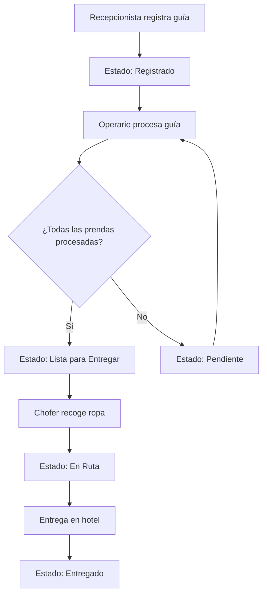

# 🧺 Sistema de Gestión de Guías de Lavandería

Sistema web moderno para digitalizar y optimizar los procesos de registro, seguimiento y entrega de ropa entre hoteles y lavanderías. Desarrollado con React, TypeScript y Node.js.

## 📋 Tabla de Contenidos

- [Características Principales](#-características-principales)
- [Stack Tecnológico](#-stack-tecnológico)
- [Arquitectura del Sistema](#-arquitectura-del-sistema)
- [Instalación y Configuración](#-instalación-y-configuración)
- [Guía de Usuario](#-guía-de-usuario)
- [API Documentation](#-api-documentation)
- [Desarrollo](#-desarrollo)
- [Deployment](#-deployment)
- [Contribución](#-contribución)

## ✨ Características Principales

### 🏨 Para Hoteles
- **Registro de Guías**: Interfaz intuitiva para registrar nuevas guías de lavandería
- **Seguimiento en Tiempo Real**: Monitoreo del estado de las prendas con barra de progreso visual
- **Gestión de Prendas**: Sistema autocompletable para selección rápida de prendas
- **Historial Completo**: Registro detallado de todos los cambios de estado

### 🧽 Para Lavanderías
- **Procesamiento de Guías**: Interface especializada para operarios de lavandería
- **Control de Cantidades**: Registro preciso de prendas limpias vs. sucias
- **Gestión de Excepciones**: Manejo de prendas devueltas o con problemas
- **Estados Operativos**: Control granular del flujo de trabajo

### 👥 Gestión de Usuarios
- **Roles Diferenciados**: Administrador, Recepcionista, Operario, Encargado
- **Autenticación Segura**: Sistema JWT con tokens de sesión
- **Permisos Granulares**: Acceso controlado según el rol del usuario

### 📊 Reportes y Analytics
- **Dashboard Interactivo**: Métricas en tiempo real del sistema
- **Filtros Avanzados**: Búsqueda por fecha, hotel, estado, etc.
- **Paginación Inteligente**: Manejo eficiente de grandes volúmenes de datos

## 🛠 Stack Tecnológico

### Frontend
- **React 18+** - Framework principal
- **TypeScript** - Tipado estático
- **Vite** - Build tool y dev server
- **Tailwind CSS** - Framework de estilos
- **React Router** - Navegación SPA
- **React Hot Toast** - Notificaciones elegantes
- **Axios** - Cliente HTTP

### Backend
- **Node.js** - Runtime de JavaScript
- **Express.js** - Framework web
- **TypeScript** - Tipado estático
- **MySQL** - Base de datos relacional
- **JWT** - Autenticación
- **bcrypt** - Hashing de contraseñas
- **CORS** - Cross-origin resource sharing

### DevOps & Tools
- **ESLint** - Linting de código
- **Prettier** - Formateo de código
- **Git** - Control de versiones
- **Kiro IDE** - Desarrollo asistido por IA

## 🏗 Arquitectura del Sistema

```
┌─────────────────┐    ┌─────────────────┐    ┌─────────────────┐
│   Frontend      │    │   Backend       │    │   Database      │
│   (React SPA)   │◄──►│   (Express API) │◄──►│   (MySQL)       │
└─────────────────┘    └─────────────────┘    └─────────────────┘
         │                       │                       │
         │              ┌─────────────────┐              │
         └──────────────►│   Auth Service  │◄─────────────┘
                        │   (JWT)         │
                        └─────────────────┘
```

### Estructura del Proyecto

```
sistema-gestion-guias-lavanderia/
├── 📁 frontend/                    # Aplicación React
│   ├── 📁 src/
│   │   ├── 📁 components/          # Componentes React
│   │   │   ├── 📁 auth/           # Autenticación
│   │   │   ├── 📁 common/         # Componentes reutilizables
│   │   │   ├── 📁 dashboard/      # Panel principal
│   │   │   ├── 📁 guias/          # Gestión de guías
│   │   │   ├── 📁 hoteles/        # Gestión de hoteles
│   │   │   ├── 📁 prendas/        # Gestión de prendas
│   │   │   └── 📁 usuarios/       # Gestión de usuarios
│   │   ├── 📁 contexts/           # Context API
│   │   ├── 📁 hooks/              # Custom hooks
│   │   ├── 📁 services/           # Servicios API
│   │   └── 📁 types/              # Definiciones TypeScript
│   ├── 📄 index.html
│   ├── 📄 package.json
│   └── 📄 vite.config.ts
├── 📁 backend/                     # API Node.js
│   ├── 📁 src/
│   │   ├── 📁 controllers/        # Controladores
│   │   ├── 📁 database/           # Configuración DB
│   │   ├── 📁 middleware/         # Middlewares
│   │   ├── 📁 routes/             # Rutas API
│   │   ├── 📁 services/           # Lógica de negocio
│   │   └── 📁 types/              # Tipos TypeScript
│   ├── 📄 package.json
│   └── 📄 server.js
├── 📁 .kiro/specs/                 # Documentación técnica
│   ├── 📄 requirements.md         # Requerimientos
│   ├── 📄 design.md               # Diseño del sistema
│   └── 📄 tasks.md                # Tareas de desarrollo
└── 📄 README.md                   # Este archivo
```

## 🚀 Instalación y Configuración

### Prerrequisitos

- **Node.js** 18+ ([Descargar](https://nodejs.org/))
- **MySQL** 8.0+ ([Descargar](https://dev.mysql.com/downloads/))
- **Git** ([Descargar](https://git-scm.com/))

### Configuración Local

1. **Clonar el repositorio**
   ```bash
   git clone <repository-url>
   cd sistema-gestion-guias-lavanderia
   ```

2. **Instalar dependencias**
   ```bash
   # Instalar dependencias del backend
   cd backend
   npm install
   
   # Instalar dependencias del frontend
   cd ../frontend
   npm install
   ```

3. **Configurar variables de entorno**
   ```bash
   # Backend (.env en la carpeta backend)
   DB_HOST=localhost
   DB_PORT=3306
   DB_NAME=lavanderia_db
   DB_USER=tu_usuario
   DB_PASSWORD=tu_password
   JWT_SECRET=tu_jwt_secret_muy_seguro
   PORT=3001
   
   # Frontend (.env en la carpeta frontend)
   VITE_API_URL=http://localhost:3001/api
   ```

4. **Configurar base de datos**
   ```sql
   -- Crear base de datos
   CREATE DATABASE lavanderia_db CHARACTER SET utf8mb4 COLLATE utf8mb4_unicode_ci;
   
   -- Ejecutar scripts de migración (ubicados en backend/database/)
   ```

5. **Ejecutar en desarrollo**
   ```bash
   # Terminal 1: Backend
   cd backend
   npm run dev
   
   # Terminal 2: Frontend
   cd frontend
   npm run dev
   ```

6. **Acceder al sistema**
   - Frontend: http://localhost:5173
   - Backend API: http://localhost:3001

### Datos de Prueba

El sistema incluye datos ficticios para demostración:

**Credenciales de acceso:**
- Email: `admin@lavanderia.com`
- Password: `123456`

## 👤 Guía de Usuario

### Tipos de Usuario y Permisos

| Rol | Permisos | Funcionalidades |
|-----|----------|-----------------|
| **Administrador** | Acceso completo | • Gestión de usuarios<br>• Gestión de hoteles<br>• Gestión de prendas<br>• Todas las funciones de guías |
| **Recepcionista** | Hotel específico | • Registrar nuevas guías<br>• Ver guías de su hotel<br>• Seguimiento de estados |
| **Operario** | Lavandería | • Procesar guías pendientes<br>• Actualizar cantidades<br>• Cambiar estados operativos |
| **Encargado** | Hotel específico | • Seguimiento de guías<br>• Reportes de su hotel<br>• Vista de solo lectura |

### Flujo de Trabajo



### Estados de Guía

| Estado | Descripción | Icono | Progreso |
|--------|-------------|-------|----------|
| **Registrado** | Guía creada, esperando procesamiento | 📝 | 16% |
| **Pendiente** | Procesamiento parcial, requiere atención | ⏳ | 33% |
| **Procesándose** | En proceso de lavado | 🔄 | 50% |
| **Lista para Entregar** | Procesamiento completo, lista para recojo | ✅ | 66% |
| **En Ruta** | Chofer en camino al hotel | 🚚 | 83% |
| **Entregado** | Proceso completado | 📦 | 100% |

### Funcionalidades Principales

#### 📝 Registro de Guías
- **Autocompletado de prendas**: Sistema inteligente de búsqueda
- **Validaciones en tiempo real**: Prevención de errores
- **Cálculo automático**: Totales y precios
- **Observaciones**: Notas adicionales para casos especiales

#### 🔄 Procesamiento de Guías
- **Interface especializada**: Diseñada para operarios
- **Control de cantidades**: Registro preciso de prendas procesadas
- **Manejo de excepciones**: Prendas perdidas, dañadas o devueltas
- **Actualización de estados**: Flujo automático según el procesamiento

#### 📊 Seguimiento y Monitoreo
- **Vista de tarjetas**: Información visual y organizada
- **Barra de progreso**: Estado visual del proceso
- **Historial detallado**: Registro completo de cambios
- **Filtros avanzados**: Búsqueda eficiente

## 📡 API Documentation

### Endpoints Principales

#### Autenticación
```http
POST /api/auth/login
Content-Type: application/json

{
  "correo": "usuario@email.com",
  "password": "contraseña"
}
```

#### Guías
```http
# Obtener guías con filtros
GET /api/guias?page=1&limit=10&estado=Registrado&hotel_id=1

# Crear nueva guía
POST /api/guias
Authorization: Bearer <token>
Content-Type: application/json

{
  "hotel_id": 1,
  "chofer_recojo_id": 10,
  "fecha_recoleccion": "2024-11-01",
  "observaciones": "Observaciones opcionales",
  "prendas": [
    {
      "hotel_prenda_id": 1,
      "cantidad_sucia": 15,
      "es_devuelta": false
    }
  ]
}

# Actualizar guía
PUT /api/guias/:id
Authorization: Bearer <token>
Content-Type: application/json

{
  "estado": "Lista para Entregar",
  "prendas": [
    {
      "id_detalle": 1,
      "cantidad_limpia": 15
    }
  ]
}
```

#### Usuarios
```http
# Obtener usuarios
GET /api/users?page=1&limit=10&perfil_id=2

# Crear usuario
POST /api/users
Authorization: Bearer <token>
Content-Type: application/json

{
  "nombre_completo": "Juan Pérez",
  "correo": "juan@email.com",
  "telefono": "123456789",
  "perfil_id": 2,
  "hotel_id": 1,
  "password": "contraseña_segura"
}
```

### Códigos de Respuesta

| Código | Descripción |
|--------|-------------|
| 200 | Éxito |
| 201 | Creado exitosamente |
| 400 | Error en la solicitud |
| 401 | No autorizado |
| 403 | Prohibido |
| 404 | No encontrado |
| 500 | Error interno del servidor |

## 🔧 Desarrollo

### Configuración del Entorno de Desarrollo

1. **Instalar extensiones recomendadas** (VS Code):
   - ES7+ React/Redux/React-Native snippets
   - TypeScript Importer
   - Tailwind CSS IntelliSense
   - ESLint
   - Prettier

2. **Configurar Git hooks**:
   ```bash
   npm install -g husky
   npx husky install
   ```

### Scripts de Desarrollo

```bash
# Backend
npm run dev          # Servidor de desarrollo con hot reload
npm run build        # Compilar TypeScript
npm run start        # Ejecutar en producción
npm run test         # Ejecutar tests

# Frontend
npm run dev          # Servidor de desarrollo
npm run build        # Build para producción
npm run preview      # Preview del build
npm run lint         # Linting
npm run type-check   # Verificación de tipos
```

### Convenciones de Código

#### Naming Conventions
- **Componentes**: PascalCase (`UserForm.tsx`)
- **Hooks**: camelCase con prefijo `use` (`useAuth.ts`)
- **Servicios**: camelCase (`userService.ts`)
- **Tipos**: PascalCase (`GuiaLavanderia`)
- **Variables**: camelCase (`userName`)
- **Constantes**: UPPER_SNAKE_CASE (`API_BASE_URL`)

#### Estructura de Componentes
```typescript
// Imports
import React, { useState, useEffect } from 'react';
import { ComponentProps } from '../types';

// Interface
interface Props {
  title: string;
  onSubmit: (data: FormData) => void;
}

// Component
const MyComponent: React.FC<Props> = ({ title, onSubmit }) => {
  // Hooks
  const [loading, setLoading] = useState(false);
  
  // Effects
  useEffect(() => {
    // Effect logic
  }, []);
  
  // Handlers
  const handleSubmit = () => {
    // Handler logic
  };
  
  // Render
  return (
    <div className="component-container">
      {/* JSX */}
    </div>
  );
};

export default MyComponent;
```

### Testing

```bash
# Ejecutar tests
npm test

# Tests con coverage
npm run test:coverage

# Tests en modo watch
npm run test:watch
```

### Metodología de Desarrollo

Este proyecto sigue **Spec-Driven Development**:

1. **Requirements** (`.kiro/specs/requirements.md`)
2. **Design** (`.kiro/specs/design.md`)  
3. **Tasks** (`.kiro/specs/tasks.md`)
4. **Implementation**

## 🚀 Deployment

### Opción 1: Vercel (Recomendado)

#### Frontend
```bash
# Instalar Vercel CLI
npm i -g vercel

# Deploy desde la carpeta frontend
cd frontend
vercel --prod
```

#### Backend (Vercel Functions)
```bash
# Deploy desde la carpeta backend
cd backend
vercel --prod
```

### Opción 2: Railway

```bash
# Instalar Railway CLI
npm install -g @railway/cli

# Login y deploy
railway login
railway init
railway up
```

### Opción 3: Docker

```dockerfile
# Dockerfile para backend
FROM node:18-alpine
WORKDIR /app
COPY package*.json ./
RUN npm ci --only=production
COPY . .
EXPOSE 3001
CMD ["npm", "start"]
```

### Variables de Entorno para Producción

```bash
# Backend
DB_HOST=tu_host_produccion
DB_NAME=lavanderia_prod
DB_USER=usuario_prod
DB_PASSWORD=password_seguro
JWT_SECRET=jwt_secret_muy_seguro_para_produccion
NODE_ENV=production

# Frontend
VITE_API_URL=https://tu-api-backend.vercel.app/api
```

## 🤝 Contribución

### Cómo Contribuir

1. **Fork** el repositorio
2. **Crear** una rama para tu feature (`git checkout -b feature/nueva-funcionalidad`)
3. **Commit** tus cambios (`git commit -m 'Agregar nueva funcionalidad'`)
4. **Push** a la rama (`git push origin feature/nueva-funcionalidad`)
5. **Crear** un Pull Request

### Reportar Bugs

Usa el template de issues para reportar bugs:

```markdown
**Descripción del Bug**
Descripción clara y concisa del problema.

**Pasos para Reproducir**
1. Ir a '...'
2. Hacer clic en '...'
3. Ver error

**Comportamiento Esperado**
Descripción de lo que esperabas que pasara.

**Screenshots**
Si aplica, agregar screenshots.

**Información del Sistema**
- OS: [e.g. Windows 10]
- Browser: [e.g. Chrome 91]
- Versión: [e.g. 1.0.0]
```

### Roadmap

- [ ] **v1.1**: Reportes avanzados y analytics
- [ ] **v1.2**: Notificaciones push y email
- [ ] **v1.3**: API móvil y app nativa
- [ ] **v1.4**: Integración con sistemas de facturación
- [ ] **v2.0**: Multi-tenancy y white-label

## 📄 Licencia

Este proyecto está bajo la Licencia MIT. Ver el archivo [LICENSE](LICENSE) para más detalles.

## 📞 Soporte

- **Email**: soporte@lavanderia-system.com
- **Documentación**: [docs.lavanderia-system.com](https://docs.lavanderia-system.com)
- **Issues**: [GitHub Issues](https://github.com/tu-usuario/sistema-gestion-guias-lavanderia/issues)

---

**Desarrollado usando React, TypeScript y Node.js**